<p align="center">
  
</p>

<h1 align="center">Codex Kaggle Arena</h1>

<p align="center">
  <strong>A human-directed, Codex-assisted competitive machine-learning workflow built around reproducible OOF evidence.</strong>
</p>

<p align="center">
  <a href="https://www.kaggle.com/competitions/playground-series-s6e2"></a>
  <a href="https://openai.com/codex/"></a>
  
  
  <a href="./LICENSE"></a>
</p>

> The GitHub repository keeps its historical slug, `antigravity-kaggle-arena`,
> so existing links remain valid. The active workflow and documentation now use
> **OpenAI Codex**, not Antigravity.

## Verified result

On 5 October 2026, V17 matched the displayed winning Private leaderboard score
for Kaggle Playground Series S6E2.

| Evidence | Value |
|---|---:|
| Final cross-fitted OOF ROC-AUC | **`0.955754551`** |
| Kaggle Public score | **`0.95394`** |
| Kaggle Private score | **`0.95535`** |
| Winning Private benchmark | **`0.95535`** |
| Kaggle submission | **`56862032`** |
| Final blend | **58% V14 + 42% V17 RealMLP** |

This was a **late submission** after the competition closed. It validates the
technical result but does not retroactively change the official historical
ranking. Read the [complete solution and submission report](docs/competitions/playground-series-s6e2.md).

## What the project actually is

This is not a claim that an agent independently won a Kaggle competition. It
is a human-in-the-loop research process:

- the user set the objective, kept the work moving, enabled Kaggle compute,
  challenged weak assumptions, and explicitly authorized submissions;
- Codex inspected evidence, changed code, managed remote training, evaluated
  OOF artifacts, proposed the next experiment, and documented the result;
- Kaggle CPU and GPU sessions performed the long-running model training;
- every accepted ensemble change was evaluated against frozen fold IDs before
  consuming a leaderboard submission.

The operating rule was simple: **do not confuse a local CV peak with a Kaggle
score, and do not stop at an interesting model when the objective is a verified
leaderboard result.**

## How V17 was reached

```mermaid
flowchart LR
    A[Audit existing V1-V5<br/>separate OOF, Public, Private] --> B[Freeze five stratified folds<br/>seed 42]
    B --> C[V6 OHE logistic diversity<br/>plus reconstructed tree blend]
    C --> D[V7 RealMLP all-categorical<br/>GPU T4]
    D --> E[V7 three-way rank blend<br/>Private 0.95532]
    E --> F[Representation and seed search<br/>V8-V13]
    F --> G[V14 raw plus bin/digit RealMLP<br/>Private 0.95534]
    G --> H[Stress tests<br/>V15 CatBoost and V16 seed blend]
    H --> I[V17 bin/digit plus original<br/>singleton statistics]
    I --> J[Cross-fitted 58/42 rank blend<br/>Private 0.95535]
```



The decisive progression was:

1. **Correct the scoreboard.** Earlier documentation mixed CV, Public, and
   Private values. The project first established V5 at `0.95507` Private and a
   real gap of `0.00028` to the winning `0.95535`.
2. **Freeze the validation boundary.** All later candidates used the same five
   stratified folds, aligned IDs, targets, fold assignments, OOF predictions,
   and test predictions.
3. **Add diversity, not more near-identical trees.** V6 added an OHE logistic
   representation; V7 added RealMLP and a shallow Ordered CatBoost model.
4. **Move training to Kaggle.** CPU models ran on Kaggle CPU; RealMLP variants
   ran on NVIDIA T4 after the account/session GPU provisioning issue was fixed.
5. **Test representations systematically.** Hybrid columns, second seeds,
   larger neural ensembles, raw-only categorical input, bin/digit features,
   and original-dataset statistics were each isolated as separate candidates.
6. **Select weights out of fold.** Candidate weights were chosen on four folds
   and scored on the held-out fifth fold, preventing an in-sample blend optimum
   from being presented as validation evidence.
7. **Use leaderboard failures as evidence.** V15 slightly improved local OOF
   but reduced Private LB to `0.95533`; it was discarded rather than rationalized.
8. **Keep the smallest useful original-data prior.** V17 retained singleton
   target mean, log-count, WoE, and entropy statistics and removed noisier pair
   statistics. Its 42% blend weight was positive on four of five held-out folds.

## Final technical design

V17 is a percentile-rank ensemble. V14 is itself a rank blend, so the expanded
deployment weights are approximately:

| Component | Effective weight | Why it remained |
|---|---:|---|
| V6 OHE/tree diversity blend | `9.135%` | Linear/tree representation diversity |
| RealMLP raw all-categorical | `21.315%` | Strong compact neural baseline |
| Ordered CatBoost depth 3 | `10.150%` | Shallow tree complement |
| RealMLP raw + bin/digit | `17.400%` | Generator-sensitive discretization signal |
| V17 RealMLP + original singletons | **`42.000%`** | Strongest marginal candidate |

The V17 model used 630,000 competition rows, 270 original-source training rows,
100 features, five folds, seed 42, `n_cv=2`, `n_ens=8`, 100 epochs, batch size
128, and CUDA. Original data was used only to derive smoothed external
statistics; validation targets were never used to build those features.

## User prompting approach

The collaboration used short, outcome-oriented prompts rather than one giant
specification. The pattern is reproducible:

- **Persistent objective:** “continue until we reach or exceed the first.”
- **Delegated momentum:** short commands such as “vai”, “prosegui”, and
  “verifica” authorized the next safe research step without prescribing code.
- **Frequent operational checks:** requests for remaining time, stuck jobs,
  CPU/GPU choice, quota, and whether training survives closing the local PC.
- **Evidence challenges:** repeated questions about distance from the top,
  whether the solution was merely copying winners, and what would happen if a
  run failed forced explicit uncertainty and fallback planning.
- **Human-controlled gates:** Kaggle submissions and GitHub publication happened
  only after explicit approval; training could proceed without automatic upload.
- **Infrastructure cooperation:** the user enabled Kaggle T4 x2 and resolved
  account verification/session settings while Codex supplied probes and checks.

This style worked because the objective stayed stable while implementation
details remained adaptive. The full prompting analysis is in the
[competition report](docs/competitions/playground-series-s6e2.md).

## Skills and supporting tools

The project installed 166 K-Dense skills plus the NVIDIA Kaggle skill in the
project-scoped `.agents/skills/` directory. The following skills were actually
invoked during this work:

| Skill | Role in the project |
|---|---|
| Codex `skill-installer` | Installed and verified project-scoped skill packages |
| [`nvidia-kaggle-skill`](https://github.com/NVIDIA/nvidia-kaggle) | Kaggle metadata, kernel lifecycle, quota checks, artifact retrieval, and guarded submissions |
| [`exploratory-data-analysis`](https://github.com/K-Dense-AI/scientific-agent-skills) | Dataset structure, distributions, synthetic/original split, leakage review |
| `scikit-learn` | Frozen stratified folds, ROC-AUC, OOF alignment, rank blending |
| `statistical-analysis` | Fold-level deltas, stability checks, conservative candidate acceptance |
| Browser control | Diagnosed the Kaggle accelerator/session state visible in the signed-in UI |
| `openai-docs` | Checked Codex/Headroom configuration during token-optimization work |
| `imagegen` | Generated the current Codex-aligned repository banner; it did not affect modeling |

Skill instructions shaped the workflow, but model selection remained governed
by measured artifacts. See [Skills & Modules](docs/wiki/02-Skills-and-Modules.md).

## Token transparency

Codex session counter snapshot immediately after the first V17 publication
(`2026-10-05 21:29 UTC`):

| Counter | Tokens |
|---|---:|
| Total processed | **`82,233,374`** |
| Input | `81,945,846` |
| Cached input | `77,965,568` (`95.14%` of input) |
| Non-cached input | `3,980,278` |
| Output | `287,528` |
| Reasoning output | `91,760` *(subset of output)* |

These are Codex runtime counters for the complete project conversation from
28 September through publication, including repeatedly processed cached
context and tool results. They are **not** 82 million unique written tokens,
not a per-skill allocation, and not a direct billing figure. Headroom savings
were global across Codex activity and could not be attributed reliably to this
repository, so they are intentionally excluded from the project total.

## Repository map

```text
.
├── README.md
├── assets/
│   └── codex-kaggle-arena-banner.png
├── docs/
│   ├── competitions/
│   │   ├── playground-series-s6e2.md
│   │   └── playground-series-s6e2-audit.md
│   └── wiki/
├── src/
│   ├── core/
│   │   ├── cv_folds.py
│   │   ├── feature_engineering_v2.py
│   │   ├── in_loop_target_encoder.py
│   │   ├── ridge_ensemble.py
│   │   ├── tabular_mlp.py
│   │   └── verify_submission.py
│   └── competitions/playground_s6e2/
│       ├── evaluate_oof_candidate.py
│       ├── train_v7_realmlp.py
│       ├── train_v7_catboost_ordered.py
│       ├── run_v15_catboost_d2_bin_digit_cpu.py
│       ├── run_v16_realmlp_bin_digit_seed1337.py
│       └── run_v17_realmlp_bin_digit_orig_singletons.py
└── tests/
```

## Reproduction boundary

The repository contains trainers, runners, evaluation logic, and integrity
tests. Competition data, original-source data, trained artifacts, and Kaggle
credentials are deliberately not committed.

The final training entry point is:

```bash
python src/competitions/playground_s6e2/run_v17_realmlp_bin_digit_orig_singletons.py
```

It is designed for a Kaggle environment containing the competition dataset,
the original dataset, and `pytabkit-model`. It writes restartable fold
checkpoints plus aligned OOF and test artifacts. Submission remains a separate,
explicit action.

Run the repository checks with:

```bash
python -m unittest discover -s tests -v
```

## Documentation

- [Complete V1–V17 solution and submission report](docs/competitions/playground-series-s6e2.md)
- [Reproducibility and evidence audit](docs/competitions/playground-series-s6e2-audit.md)
- [Mission and Codex operating loop](docs/wiki/01-mission-and-architecture.md)
- [Skills and core modules](docs/wiki/02-skills-and-modules.md)
- [Evolution playbook](docs/wiki/03-evolution-playbook.md)
- [GitHub Wiki](https://github.com/BlockFrame/antigravity-kaggle-arena/wiki)

## License

Apache License 2.0. See [LICENSE](LICENSE).
