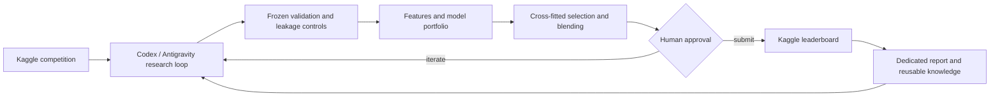

<p align="center">
  
</p>

<h1 align="center">Agentic Kaggle Arena</h1>

<p align="center">
  <strong>A human-directed, agent-assisted laboratory for repeatable Kaggle competition work.</strong>
</p>

<p align="center">
  <a href="https://www.kaggle.com/"></a>
  <a href="https://openai.com/codex/"></a>
  
  <a href="./LICENSE"></a>
</p>

## The initiative

Agentic Kaggle Arena is a long-running initiative for competing in multiple
Kaggle challenges with a human setting the objective and controlling important
decisions while coding agents carry out research, implementation, remote-run
orchestration, analysis, and documentation.

The repository began around an Antigravity workflow and now also uses OpenAI
Codex. It is intentionally not tied to one assistant, one model family, or one
competition. The durable asset is the method: turn every run into comparable
evidence, retain failures as knowledge, and make successful solutions
reproducible.

## Operating principles

- **Human-directed:** the user owns objectives, risk, submissions, and publication.
- **Evidence-first:** OOF, Public LB, and Private LB results are never mixed.
- **One hypothesis per experiment:** model, representation, seed, or blend policy changes remain attributable.
- **Remote and restartable:** long CPU/GPU jobs run on Kaggle with checkpoints and recoverable artifacts.
- **Competition-specific reports:** each challenge receives its own technical history instead of turning this README into a single-solution write-up.
- **Reusable learning:** code, skills, prompting patterns, compute choices, failures, and token accounting are documented when relevant.



## Tool ecosystem

| Tool | Role |
|---|---|
| OpenAI Codex | Repository work, experiment design, implementation, analysis, and documentation |
| Google Antigravity | Original agentic workspace and an alternative orchestration environment |
| [NVIDIA Kaggle skill](https://github.com/NVIDIA/nvidia-kaggle) | Competition discovery, kernels, accelerators, artifacts, quotas, and guarded submissions |
| [K-Dense Scientific Agent Skills](https://github.com/K-Dense-AI/scientific-agent-skills) | Reusable scientific procedures for EDA, statistics, validation, and ML workflows |
| Kaggle CPU/GPU/TPU | Managed remote compute that keeps long training independent of the local computer |
| GitHub and GitHub Wiki | Versioned source, decision history, audits, and public knowledge base |

Skills guide the work; measured competition evidence still decides whether a
candidate is accepted.

## Competition portfolio

| Competition | Metric | Best verified result | Documentation |
|---|---|---:|---|
| Playground Series S6E2 — Predicting Heart Disease | ROC-AUC | Private `0.95535`, displayed winner score matched by late submission | [Complete V1–V17 report](docs/competitions/playground-series-s6e2.md) · [Evidence audit](docs/competitions/playground-series-s6e2-audit.md) |

The S6E2 result validates the workflow but is only its first fully documented
case study. Future competitions will have separate source modules, artifacts,
and reports under `src/competitions/` and `docs/competitions/`.

## Standard competition loop

1. Define the target metric, constraints, and explicit success condition.
2. Audit data, provenance, leakage risks, and existing leaderboard evidence.
3. Freeze folds and the artifact schema before model search.
4. Build a diverse portfolio of representations and model families.
5. Compare candidates by aligned OOF evidence and marginal blend value.
6. Run expensive jobs remotely with checkpoints and fail-fast accelerator checks.
7. Keep training separate from submission; submit only after a human gate.
8. Publish the complete path, including rejected experiments and limitations.

## Repository map

```text
.
├── README.md                       # initiative-level overview
├── assets/                         # reusable repository identity
├── docs/
│   ├── competitions/               # one report and audit per competition
│   └── wiki/                       # version-controlled GitHub Wiki sources
├── src/
│   ├── core/                       # reusable validation, features, ensembles, gates
│   └── competitions/               # competition-specific trainers and runners
└── tests/                           # integrity and regression checks
```

Competition data, credentials, trained artifacts, and large predictions are
not committed. A report must state the environment and reproduction boundary
instead of implying that private inputs are present in the repository.

## Adding a competition

Create a dedicated `src/competitions/<competition>/` package and a
`docs/competitions/<competition>.md` report. Record the baseline, validation
contract, experiment ledger, compute environment, best reproducible command,
submission evidence, and known limitations. Add only a summary row here and a
page in the Wiki competition index.

## Documentation

- [GitHub Wiki](https://github.com/BlockFrame/antigravity-kaggle-arena/wiki)
- [Mission and architecture](docs/wiki/01-mission-and-architecture.md)
- [Skills and reusable modules](docs/wiki/02-skills-and-modules.md)
- [Evolution playbook](docs/wiki/03-evolution-playbook.md)
- [Competition index](docs/wiki/Competitions.md)
- [Playground Series S6E2 case study](docs/competitions/playground-series-s6e2.md)

Run the repository checks with:

```bash
python -m unittest discover -s tests -v
```

## License

Apache License 2.0. See [LICENSE](LICENSE).
