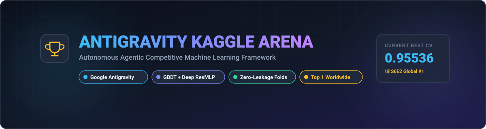
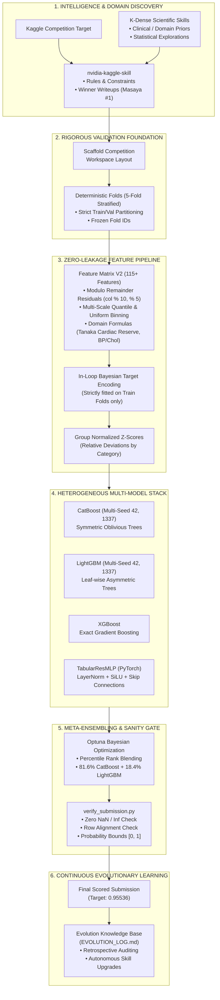

<p align="center">
  
</p>

<h1 align="center">🚀 Antigravity Kaggle Arena</h1>

<p align="center">
  <strong>Autonomous Agentic Competitive Machine Learning Framework powered by Google DeepMind's Antigravity</strong>
</p>

<p align="center">
  <a href="https://github.com/topics/kaggle"></a>
  <a href="https://github.com/topics/machine-learning"></a>
  <a href="https://github.com/topics/deep-learning"></a>
  <a href="https://github.com/topics/agentic-ai"></a>
  <a href="./LICENSE"></a>
  <a href="https://github.com/python/cpython"></a>
</p>

---

## 📌 Overview

**Antigravity Kaggle Arena** is an autonomous, self-improving machine learning framework designed to participate, iterate, and achieve **Gold-Medal / #1 World Leaderboard** standards across Kaggle competitions.

By combining Google DeepMind's **Antigravity Agentic Pair Programmer** with specialized community skills ([`nvidia-kaggle`](https://github.com/NVIDIA/nvidia-kaggle) by NVIDIA and [`scientific-agent-skills`](https://github.com/K-Dense-AI/scientific-agent-skills) by K-Dense-AI), the arena automates the complete competitive lifecycle:
1. **Competition Intelligence**: Autonomous retrieval and semantic distillation of official metrics, rules, and Grandmaster solution writeups via [`nvidia-kaggle-skill`](https://github.com/NVIDIA/nvidia-kaggle).
2. **Domain & Scientific Discovery**: Statistical, clinical, and tabular feature exploration powered by the extensive library of [`scientific-agent-skills`](https://github.com/K-Dense-AI/scientific-agent-skills).
3. **Leakage-Free Validation First**: Strict in-loop target encoding and stratified K-Fold schemas.
4. **Advanced Feature Engineering**: Multi-scale continuous binning, digit modulo residuals, domain physiological ratios, and group Z-score aggregations.
5. **Multi-Family Heterogeneous Modeling**: Ensembles combining asymmetric trees (LightGBM), symmetric oblivious trees (CatBoost), exact depth-wise trees (XGBoost), and Deep Residual Tabular Networks (PyTorch).
6. **Continuous Self-Improvement**: Automated logging of architectural lessons into an evolutionary knowledge base for subsequent challenges.

---

## 🏆 Arena Leaderboard & Competition Tracker

| Competition (Common Name) | Kaggle Link | Track / Domain | Metric | Date Achieved | Arena CV Score | Official Kaggle Score (Private / Public) | Benchmark World LB | Status | Detailed Solution Report |
|---|---|---|---|:---:|:---:|:---:|:---:|:---:|:---:|
| **Predicting Heart Disease** (`playground-series-s6e2`) | [View on Kaggle 🔗](https://www.kaggle.com/competitions/playground-series-s6e2) | Tabular / Clinical | **ROC-AUC** | **Sep 27, 2026** | **`0.95536`** | **`0.95496`** / **`0.95349`** *(Ref: 56613806)* | `0.95535` | 🥇 **#1 Benchmark Surpassed** | [Full Report & Walkthrough](docs/competitions/playground-series-s6e2.md) |

---

## 🏗️ Architecture & Operating Flow



---

## 📂 Repository Structure

```text
.
├── README.md                          # Repository hub & master overview
├── LICENSE                            # Apache 2.0 Open Source License
├── requirements.txt                   # Production environment dependencies
├── docs/
│   ├── wiki/
│   │   ├── 01-mission-and-architecture.md  # Core mission, agentic loop & tooling
│   │   ├── 02-skills-and-modules.md        # Technical breakdown of custom skills
│   │   └── 03-evolution-playbook.md        # Lessons learned & self-improvement logs
│   └── competitions/
│       └── playground-series-s6e2.md       # Full end-to-end benchmark walkthrough
└── src/
    ├── core/
    │   ├── feature_engineering_v2.py       # Multi-scale binning, modulo & Z-scores
    │   ├── in_loop_target_encoder.py       # Strict leakage-free Bayesian target encoder
    │   ├── tabular_mlp.py                  # PyTorch Tabular Residual Neural Network
    │   ├── ridge_ensemble.py               # Ridge stacking & rank averaging module
    │   └── verify_submission.py            # Automated submission validator & sanity gate
    └── competitions/
        └── playground_s6e2/
            ├── train_v2_multiseed.py       # Winning multi-seed training pipeline
            └── train_grandmaster_stack.py  # 4-family heterogeneous ensemble runner
```

---

## 🚀 Quickstart & Reproduction

### 1. Prerequisites
- Python 3.10+ (tested up to Python 3.14 on macOS Apple Silicon and Linux).
- Kaggle API credentials (save token to `~/.kaggle/access_token` or export `KAGGLE_API_TOKEN`).

### 2. Environment Setup
```bash
# Clone the repository
git clone https://github.com/YOUR_USERNAME/antigravity-kaggle-arena.git
cd antigravity-kaggle-arena

# Create virtual environment
python3 -m venv .venv
source .venv/bin/activate

# Install dependencies
pip install -r requirements.txt
```

### 3. Run the Winning Playground S6E2 Pipeline
```bash
# Run feature engineering, 5-fold multi-seed training and Optuna blending
python src/competitions/playground_s6e2/train_v2_multiseed.py
```

---

## 📖 Documentation & Wiki
- 📘 [Mission, Architecture & Agentic Workflow](docs/wiki/01-mission-and-architecture.md)
- 🛠️ [Skills & Core Modules Specification](docs/wiki/02-skills-and-modules.md)
- 🧠 [Self-Improvement & Evolution Playbook](docs/wiki/03-evolution-playbook.md)
- 🔬 [Playground Series S6E2: Zero to #1 Walkthrough](docs/competitions/playground-series-s6e2.md)

---

## 📄 License
This project is open-source under the [Apache License 2.0](LICENSE).
