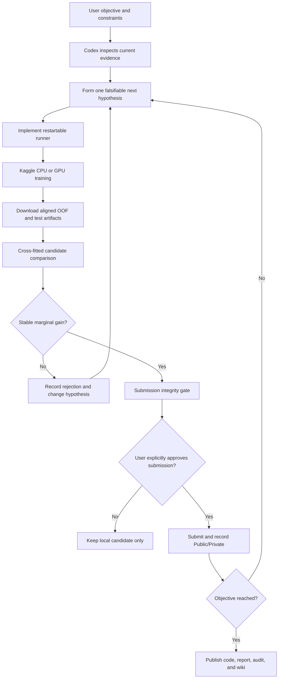

# Mission and Codex operating architecture

## Mission

Codex Kaggle Arena turns a user-defined competitive objective into a sequence
of reproducible experiments. It is designed for the part of tabular competition
work where a few ten-thousandths of ROC-AUC separate a strong result from the
target.

The project is human-directed:

- the user owns the goal, compute access, risk decisions, submissions, and
  publication authorization;
- Codex owns repository inspection, implementation, experiment orchestration,
  evidence comparison, and documentation;
- Kaggle provides remote CPU/GPU execution and the final external score.

## Evidence loop



## Non-negotiable boundaries

1. **One frozen validation split.** Candidates share IDs, targets, and fold IDs.
2. **No global supervised preprocessing.** Target-dependent transforms are fit
   inside the active training partition.
3. **OOF is not leaderboard.** Every score is labeled by source.
4. **Marginal value beats standalone value.** A model enters the ensemble only
   if it improves the fixed base outside its selection fold.
5. **Submission is separate from training.** Remote jobs cannot spend Kaggle
   submissions automatically.
6. **Failures remain documented.** A local gain that regresses Private LB is
   evidence, not something to hide.

## Compute architecture

```text
Local Codex workspace
  ├─ code, tests, fold definitions, evaluators
  ├─ Kaggle API orchestration and artifact download
  └─ local OOF analysis and documentation

Kaggle CPU
  └─ CatBoost candidates and long shallow-tree folds

Kaggle NVIDIA T4
  └─ RealMLP candidates with CUDA fail-fast and fold checkpoints

GitHub
  ├─ source repository
  └─ synchronized Wiki generated from versioned documentation
```

## Decision protocol

Each candidate answers one question: new model family, representation, seed,
feature source, or ensemble policy. Changing several at once would make a gain
impossible to attribute.

For an ensemble candidate:

1. rank-transform base and candidate predictions;
2. choose the candidate weight on four folds;
3. evaluate it on the fifth;
4. repeat for all held-out folds;
5. inspect total delta, fold signs, correlation, and weight stability;
6. use the median held-out weight for a possible test blend;
7. submit only after user approval.

## Outcome

This loop moved the verified S6E2 Private score from V5's `0.95507` to V17's
`0.95535`, matching the displayed winner benchmark through late submission
`56862032`.
