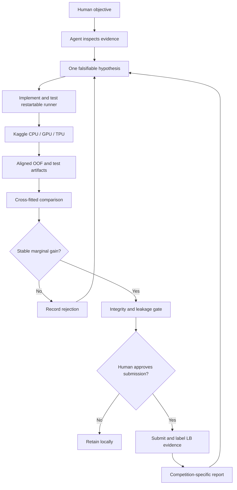

# Mission and operating architecture

## Mission

The Arena converts a user-defined competitive objective into a traceable sequence of experiments. It survives changes in competition, agent, model family, and accelerator: Codex and Antigravity are participants in a stable evidence loop, not the identity of the project.

## Responsibility model

| Participant | Responsibility |
|---|---|
| Human competitor | Sets the objective, resolves strategic choices, enables account resources, and approves submissions/publication |
| Codex or Antigravity | Inspects evidence, proposes hypotheses, edits and tests code, operates remote runs, and reports uncertainty |
| Specialist skills | Supply procedures for Kaggle operations, EDA, statistics, validation, and reporting |
| Kaggle | Provides datasets, CPU/GPU/TPU runtimes, submissions, and leaderboard evidence |
| GitHub | Preserves source, experiment history, audits, and the public Wiki |

## Non-negotiable boundaries

1. Freeze validation before serious model search.
2. Fit supervised preprocessing only inside the active training partition.
3. Label every score as OOF, Public LB, or Private LB.
4. Judge ensemble additions by marginal held-out value.
5. Store IDs, folds, predictions, metrics, and restartable checkpoints.
6. Keep remote training separate from submission.
7. Publish important failures and limitations.

## Compute architecture

Local workspaces hold code, tests, folds, evaluation, and reports. Kaggle CPU runs long tree or linear workloads; Kaggle GPU supports neural and accelerated boosting workloads; TPU is selected only when the implementation can use it. GitHub synchronizes the version-controlled Wiki. This lets training continue when the local computer is closed and lets a future agent reconstruct every decision.
