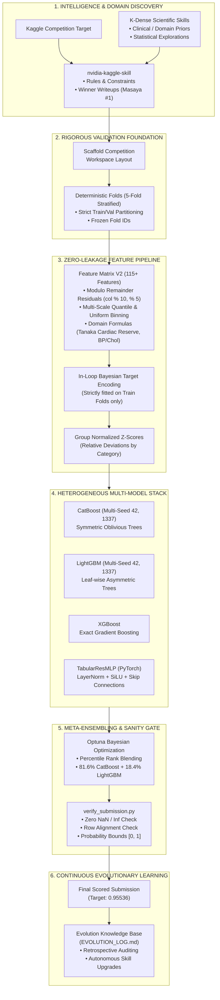

# Wiki: Project Mission & Agentic Architecture

## 1. Executive Summary & Objective

The primary objective of the **Antigravity Kaggle Arena** is to pioneer an autonomous, rigorous, and continuously evolving competitive machine learning system using **Google DeepMind's Antigravity AI coding assistant**.

Competitive data science on Kaggle typically suffers from fragmented workflows:
- Feature generation is often ad-hoc and prone to target leakage.
- Ensembling frequently falls into the trap of stacking collinear models without true statistical diversity.
- Learnings from one competition are rarely formalized into programmatic tools for the next challenge.

This project bridges these gaps by establishing an **autonomous agentic pair programming framework** that treats every Kaggle competition as a validation-first problem, extracts intelligence from top Grandmasters, constructs robust multi-model pipelines, and archives evolutionary breakthroughs.

---

## 2. Integrated Tooling & Skills Ecosystem

The system synthesizes two cutting-edge agentic toolkits:

---

## 3. The 5-Stage Agentic Operating Loop

Every competition entered by the Arena follows a strict 5-stage lifecycle:

### Stage 1: Intelligence Discovery & Metric Extraction
- Queries the Kaggle API to inspect the official scoring metric, data dictionary, submission format, and hidden-test constraints.
- Employs `fetch_leaderboard_writeups.py` and `fetch_writeup.py` to harvest insights, validation splits, and structural nuances from past winners.

### Stage 2: Validation-First Architecture & Scaffolding
- Instantiates a clean, standardized project layout (`input/`, `src/`, `models/`, `oof/`, `submissions/`).
- Freezes a deterministic Stratified K-Fold / Group K-Fold split column before any feature engineering begins.

### Stage 3: Feature Engineering with Zero Leakage
- Generates multi-scale representations (binning, digit modulo residuals, domain physiological formulas, group Z-scores).
- All statistics and target encodings are calculated **strictly within the training folds** of each split.

### Stage 4: Heterogeneous Multi-Family Modeling & Blending
- Trains diverse model families (CatBoost, LightGBM, XGBoost, and PyTorch Tabular ResMLP).
- Executes multi-seed averaging per fold to suppress stochastic split variance.
- Applies Bayesian optimization via Optuna to determine optimal rank-averaging weights.

### Stage 5: Verification Gate & Evolutionary Feedback
- Runs `verify_submission.py` to guarantee non-null values, row integrity, column alignment, and valid probability boundaries.
- Records all performance deltas, correlation metrics, and architectural decisions into `EVOLUTION_LOG.md`.
